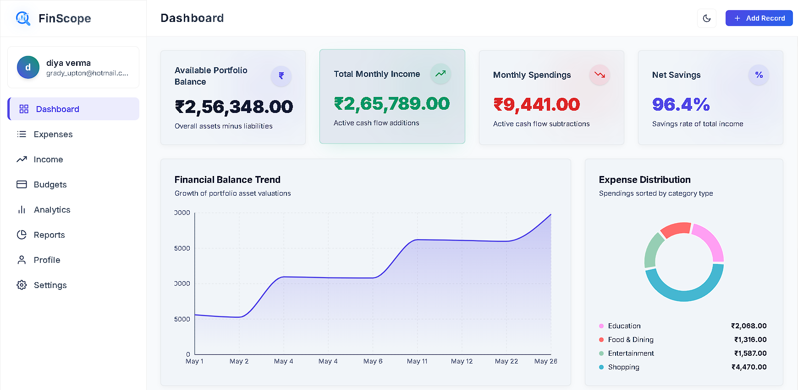
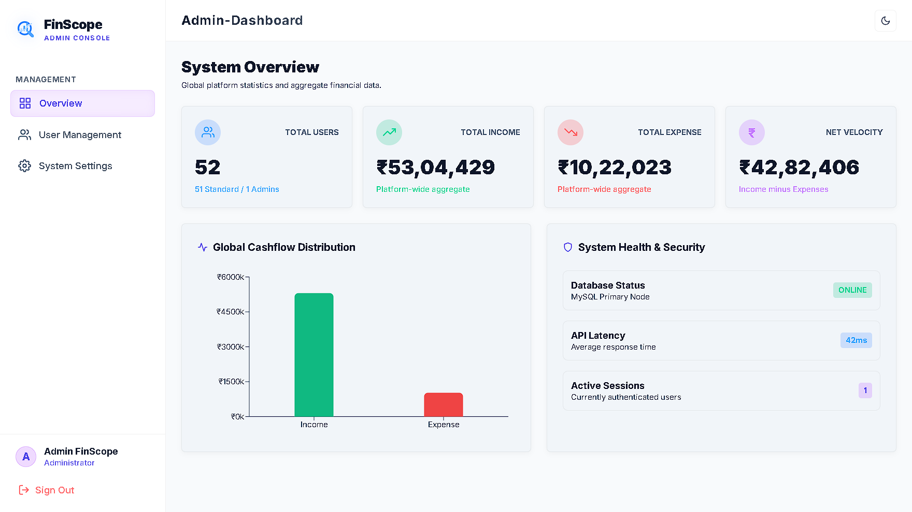
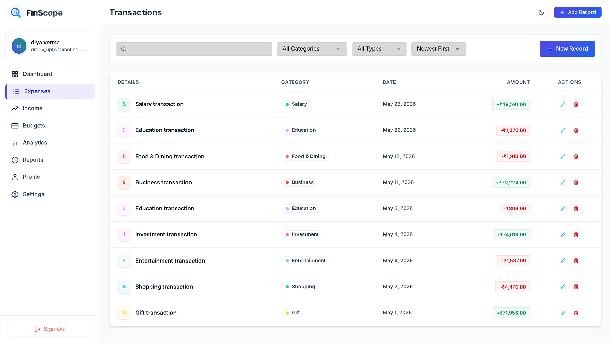
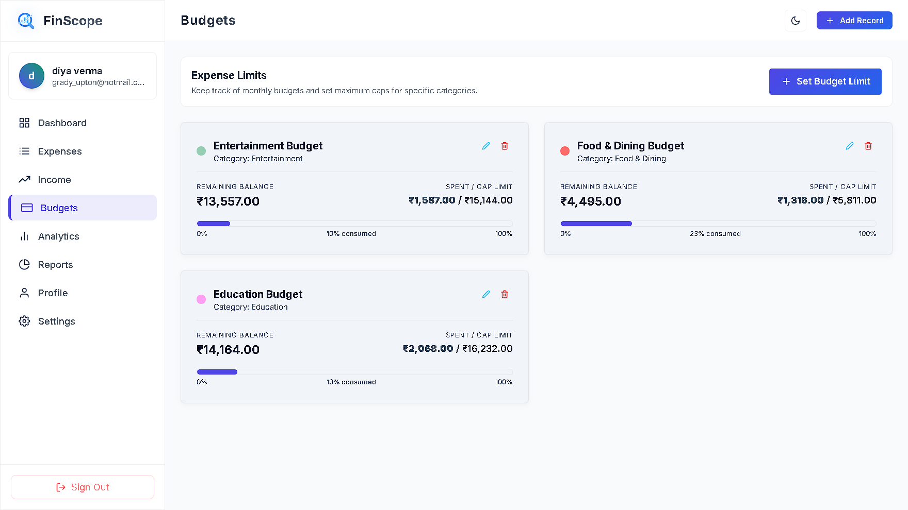
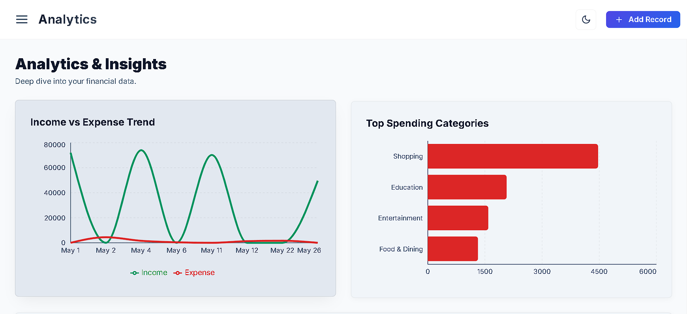

# 📊 FinScope — Personal Finance Tracker

A modern full-stack finance management system to track income, expenses, budgets, and financial insights with real-time analytics.

---

## 🚀 Badges


---

## ✨ Features

* 👤 **User Authentication:** Secure login & registration using JWT and Spring Security.
* 💰 **Income & Expense Tracking:** Log and manage daily financial transactions.
* 📊 **Category-wise Analytics:** Visual breakdowns of spending using Recharts.
* 🧾 **Budget Management:** Set monthly budget ceilings and track percentage spent.
* 📅 **Monthly Financial Summaries:** Easily view current month vs previous metrics.
* 🌱 **Faker-based Data Seeding:** Quickly populate the database with realistic dummy data.
* ⚡ **REST API Architecture:** Robust, scalable Java Spring Boot backend.

---

## 🖼️ Screenshots

### 📊 Dashboard Overview



### 💰 Transactions Page


### 🧾 Budget Management


### 📈 Analytics View


---

## 🏗️ Tech Stack

### Frontend
* **React 18** (Vite)
* **Recharts** (Data visualization)
* **React Router DOM** (Navigation)
* **Vanilla CSS** (Custom, responsive UI)

### Backend
* **Java 17+**
* **Spring Boot 3** (REST API)
* **Spring Security** (JWT Authentication)
* **Spring Data JPA / Hibernate** (ORM)

### Database
* **MySQL 8**

### Tools
* **Maven** (Backend package management)
* **Node.js & Faker.js** (Data generation script)
* **bcrypt** (Password hashing via Spring Security)

---

## 📁 Project Structure

```text
FinScope/
│
├── backend/                  # Java / Spring Boot API
│   ├── src/main/java/.../
│   │   ├── config/           # Security & CORS Config
│   │   ├── controller/       # REST Endpoints
│   │   ├── dao/              # Database Repositories
│   │   ├── model/            # JPA Entities
│   │   ├── filter/           # JWT Filters
│   │   └── util/             # Helpers (JwtUtil)
│   └── pom.xml
│
├── frontend/                 # React / Vite App
│   ├── src/
│   │   ├── components/       # Reusable UI (Cards, Buttons)
│   │   ├── context/          # AuthContext
│   │   ├── pages/            # Dashboard, Transactions, Budgets
│   │   └── App.jsx           # Routing
│   └── package.json
│
├── scripts/                  # Utilities
│   └── data-generator/       # Node.js Fake Data Seeder
│
├── database/                 # SQL Scripts
│   └── finscope.sql          # Schema Definition
│
└── README.md
```

---

## ⚙️ Installation

### 1️⃣ Clone Repository

```bash
git clone https://github.com/roshanG077/finscope.git
cd finscope
```

---

### 2️⃣ Run Database Schema

Create a MySQL database named `finscope` and import the schema:
```bash
mysql -u root -p finscope < database/finscope.sql
```

---

### 3️⃣ Start Backend (Spring Boot)

Open the `backend` directory and configure `src/main/resources/application.properties` with your database credentials:
```properties
spring.datasource.url=jdbc:mysql://localhost:3306/finscope
spring.datasource.username=root
spring.datasource.password=your_password
```

Run the application:
```bash
cd backend
mvn spring-boot:run
```
*(Runs on port 8080 by default)*

---

### 4️⃣ Start Frontend (React)

```bash
cd frontend
npm install
npm run dev
```
*(Runs on port 5173 by default)*

---

## 🌱 Data Seeder

Generates realistic users, budgets, and transactions using Faker.js.

```bash
cd scripts/data-generator
npm install
npm run generate:data
```
⚠️ *Note: Requires Node.js installed on your system. Do not run on a production database!*

---

## 🔐 Security

* Password hashing via Spring Security `BCryptPasswordEncoder`
* Stateless API using JWT (JSON Web Tokens)
* Protected REST endpoints with `@AuthenticationPrincipal`
* CORS configured for secure frontend-backend communication

---

## 📈 Future Enhancements

* AI-based spending prediction
* PDF financial reports
* Mobile app (React Native)
* Smart budget alerts
* Investment tracking module

---

## 👨‍💻 Author

**Roshan Gupta**

---

## 📄 License

This project is licensed under the MIT License.
